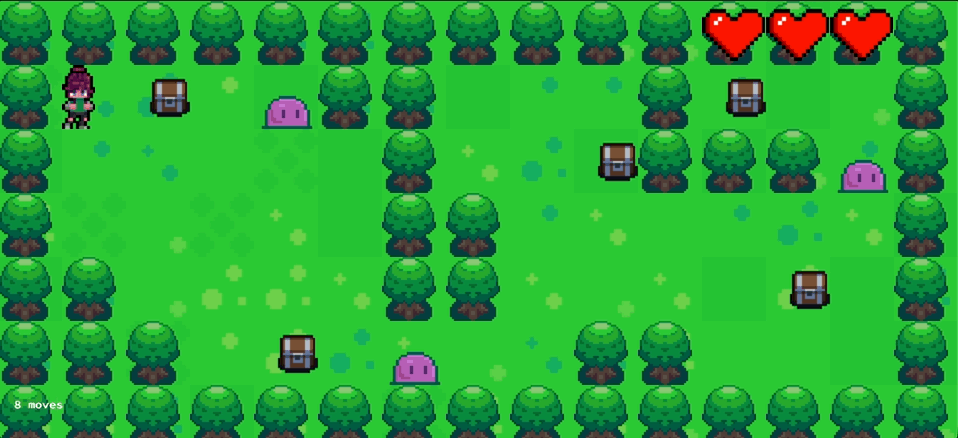
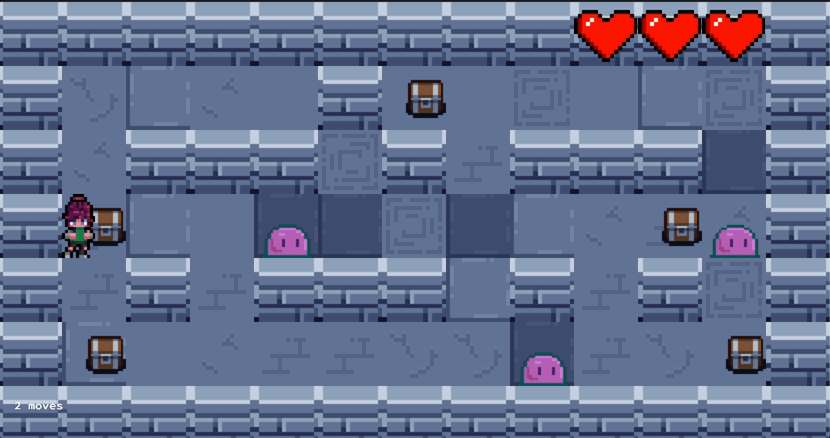

# So Long

So Long is a 2D top-down adventure game developed in C. This is my first graphical project within the 42 school curriculum, built from scratch using the MiniLibX library.

The mission is simple: loot every chest, evade or defeat the guardians, and find the exit while optimizing your path to finish with the fewest moves possible.


## Features

**Combat System:** Use your Dash to attack and eliminate enemies in your path.
**Survival Mechanics:** You have 3 health points. Every contact with an enemy costs you a life.
**Random Biomes:** Every time you start a game, the game randomly chooses between a lush Forest theme or a dark Cave atmosphere.
**Step Counter:** A real-time movement tracker to challenge you to find the most efficient route.

## Gameplay Preview

<p align="center">
  
  
</p>

## Controls

| Key | Action |
| :--- | :--- |
| W, A, S, D | Move (Up, Left, Down, Right) |
| E | Interact / Open Chests |
| SPACE | Special Attack (Dash) |
| ESC | Safe Exit |


## Prerequisites

The MiniLibX is directly included in the repository.
The game engine is optimized for both Linux and MacOS.

**Linux**
```
sudo apt install sudo apt-get install libx11-dev libxext-dev zlib1g-dev
```

**MacOS**
```
xcode-select --install
```

## Installation & Launch

1.  **Clone the repository:**
```
git clone https://github.com/hdougoud/So_Long.git
cd So_Long
```

2.  **Launch the Campaign Mode (5 levels):**
```
make demo
```

3.  **Launch a custom map:**
```
./so_long assets/maps/your_map.ber
```

> [!NOTE]
> Custom maps must use the `.ber` extension and follow standard parsing rules (closed walls, at least one collectible, one spawn, and one exit).


## Credits

* **Code:** Entirely developed in C by myself as part of the 42 curriculum.
* **Assets:** A huge thank you to the **itch.io** community for the sprites and textures used in this project.
